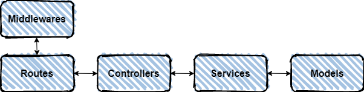

# API Template

API Template using Node, Sequelize, Nodemon, Babel, Eslint and more...

# Table of content

- [Development](#development)

- [Conventions](#conventions)

- [Controllers](#controllers)

- [Models](#models)

- [Routes](#routes)

- [API Filters and more](#filters-and-more)

---



---

# Development

Install all dependencies

```bash
$ npm install
```

*ENV file*

The `env` file contains a series of variables that modify the behavior of the api.

```text
# API
PORT=5000 

# Database
DATABASE_HOST=localhost
DATABASE_PORT=5444
DATABASE_NAME=postgres
DATABASE_USER=postgres
DATABASE_PASSWORD=postgres

# Sequelize
FORCE_SYNC=true # Create tables from models
```

For development

```bash
$ npm run dev
```

**Build**

For created a production version
```bash
$ npm run build
```

**Run Production**

```bash
$ npm run start
```

---

# Conventions
- All file names, classes, models, services must be in singular notation and upper camel case.
  ```javascript
    // controllers/UserController.js
    class UserController{}
    
    // services/UserService.js
    class UserService{}

    // models/User.js
    const User = sequelize.define('users', {});

    // routes/User.js
    const router = Router();
  ```

### Controllers

The `controllers` directory contains the files which in turn contains `classes` with `static methods`, this helps keep the application logic away from the `routers` and other important parts.

**Exmaple**
```javascript
//Imports 

// Class with Controller subfix
class ProjectsController {

    //Method with static and async instruction
    static async getProjects(req, res) {
      //Try and catch for manage errors
    try {
      const projects = await Project.findAll();
      res.json({
        data: projects
      })
    } catch (error) {
      res.status(500).json({
        message: 'Something goes wrong',
        data: error
      })
    }
  }
}
```

### Models

The `models` are the ones in charge of interacting with the database, they contain all our columns in an abstraction layer.

**Example**

```javascript
import Sequelize from 'sequelize';
import { sequelize } from '../database/database';

const Project = sequelize.define('projects', {
  id: {
    type: Sequelize.INTEGER,
    primaryKey: true,
    autoIncrement: true
  },
  name: { type: Sequelize.TEXT },
  // More columns...
},{});

export default Project;
```
[Sequelize documentation (V6)](https://sequelize.org/)

### Routes

The `routes` are in charge of passing the request data to the `controllers` and invoking these.

```javascript
import {Router} from 'express';
import ProjectsController from '../controllers/Project.controller';

const router = Router();

router.get('/:id', ProjectsController.getProject );

export default router;
```

# Filters and More

The filters and sort work with `QueryStringConvertHelper.js` Util, for use it only import and use in your controller.

```javascript
import querystringConverterHelper from '../utils/querystringConverterHelper';

// ..
let { where, limit, offset, order } = querystringConverterHelper.parseQuery(query);

```

## Query string

**Filters**

**between**

For example for check createdAt from `2020-09-01` to `2020-09-30`.

```
api/visits?createdAt=between:2020-09-01,2020-09-30
```

**Like**

For using `like` operator you can pass `search` query string var with `where` for indicate columns.

```
api/visits?search=some&where=reasonVisit
```

This search for `some` in `reasonVisit` column.

**Limit and offset**

You can use `limit` and `offset` for pagination.

```
api/visits?limit=10&page=2
```

This example returns the records between 11 to 20

**Order**

Use `-` sign for descending while `+` for ascending, by default if sign is not presented it will automatically set to `+` sign (ex: `sort=-created_at` or `sort=+created_at`). Value can be separated by a comma if multiple sort condition is needed (ex: `sort=id,name`).

```
api/visits?sort=-created_at
```

More information: [https://github.com/perbert27/sequelize-querystring-converter](https://github.com/perbert27/sequelize-querystring-converter)
